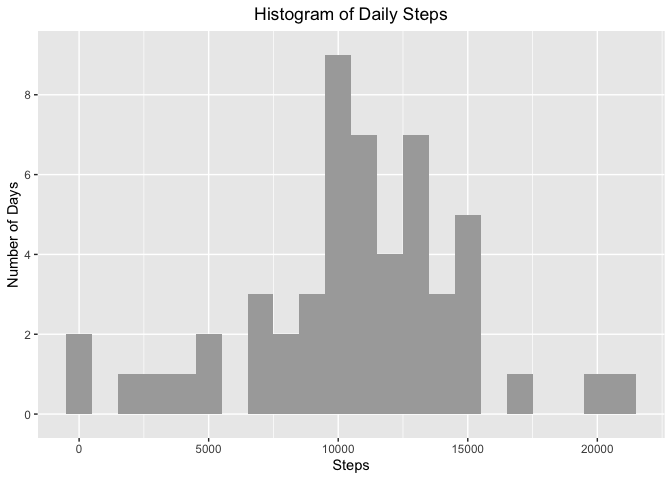
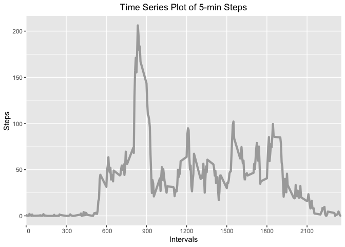
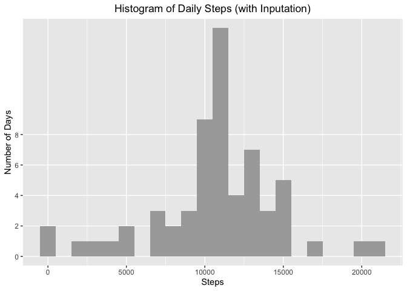
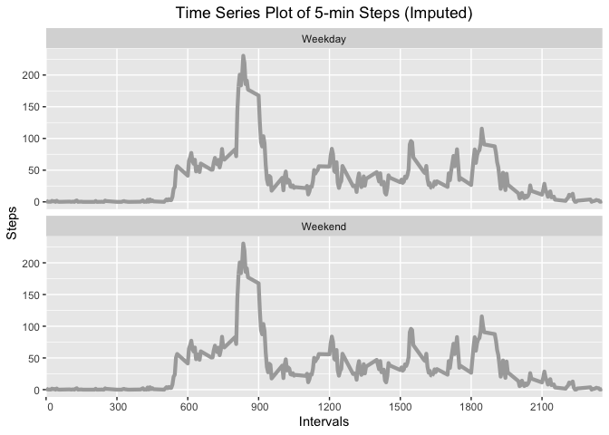

Author: Kat Jump


```r
library(ggplot2)
## Loading and preprocessing the data
setwd("~/assignment")
data0<-read.csv(file="activity.csv")
str(data0)
```

```
## 'data.frame':	17568 obs. of  3 variables:
##  $ steps   : int  NA NA NA NA NA NA NA NA NA NA ...
##  $ date    : Factor w/ 61 levels "2012-10-01","2012-10-02",..: 1 1 1 1 1 1 1 1 1 1 ...
##  $ interval: int  0 5 10 15 20 25 30 35 40 45 ...
```

```r
head(data0)
```

```
##   steps       date interval
## 1    NA 2012-10-01        0
## 2    NA 2012-10-01        5
## 3    NA 2012-10-01       10
## 4    NA 2012-10-01       15
## 5    NA 2012-10-01       20
## 6    NA 2012-10-01       25
```

```r
## What is mean total number of steps taken per day?
### 1. Calculate the total number of steps taken per day
perday0<-aggregate(data0$steps, by=list(data0$date), sum) #compare with tapply: perday2<-tapply(data0$steps,data0$date, sum, na.rm=TRUE, simplify = FALSE) (aggregate gives a data frame, tapply gives by defalt a scalar, simplify=FALSE-->a list). ggplot only works on data frame
head(perday0)
```

```
##      Group.1     x
## 1 2012-10-01    NA
## 2 2012-10-02   126
## 3 2012-10-03 11352
## 4 2012-10-04 12116
## 5 2012-10-05 13294
## 6 2012-10-06 15420
```

```r
### 2. Make a histogram of the total number of steps taken each day
gperday0<-ggplot(perday0, aes(x))+geom_histogram(binwidth=1000, fill="dark grey")+labs(title = "Histogram of Daily Steps", x="Steps")+theme(plot.title = element_text(hjust = 0.5))+scale_y_discrete(name="Number of Days", limits=c(0,2,4,6,8))
gperday0
```

```
## Warning: Removed 8 rows containing non-finite values (stat_bin).
```

<!-- -->

```r
### 3. Calculate and report the mean and median total number of steps taken per day
mean(perday0$x, na.rm = T)
```

```
## [1] 10766.19
```

```r
median(perday0$x, na.rm = T)
```

```
## [1] 10765
```

```r
#### Answer: mean is 10766.19; median is 10765

## What is the average daily activity pattern?
### 1. Make a time series plot (i.e. type = "l") of the 5-minute interval (x-axis) and the average number of steps taken, averaged across all days (y-axis)
intervals<-aggregate(data0$steps, by=list(as.factor(data0$interval)), mean, na.rm=TRUE)
str(intervals)
```

```
## 'data.frame':	288 obs. of  2 variables:
##  $ Group.1: Factor w/ 288 levels "0","5","10","15",..: 1 2 3 4 5 6 7 8 9 10 ...
##  $ x      : num  1.717 0.3396 0.1321 0.1509 0.0755 ...
```

```r
head(intervals)
```

```
##   Group.1         x
## 1       0 1.7169811
## 2       5 0.3396226
## 3      10 0.1320755
## 4      15 0.1509434
## 5      20 0.0754717
## 6      25 2.0943396
```

```r
gintervals<-ggplot(intervals, aes(x=as.numeric(as.character(Group.1)), y=x))+geom_line(color="dark grey", size=1.5)+labs(title="Time Series Plot of 5-min Steps", x="Intervals", y="Steps")+theme(plot.title = element_text(hjust = 0.5))+scale_x_discrete(name="Intervals", limits=c(0, 300, 600, 900, 1200, 1500, 1800, 2100))
gintervals
```

<!-- -->

```r
### 2. Which 5-minute interval, on average across all the days in the dataset, contains the maximum number of steps? 
intervals[grep(max(intervals$x), intervals$x), 1]
```

```
## [1] 835
## 288 Levels: 0 5 10 15 20 25 30 35 40 45 50 55 100 105 110 115 120 ... 2355
```

```r
#### Answer: Interval 835

## Imputing missing values
### 1. Calculate and report the total number of missing values in the dataset (i.e. the total number of rows with NAs)
sum(is.na(data0$steps))
```

```
## [1] 2304
```

```r
#### Answer: 2304 missing values

### 2. Devise a strategy for filling in all of the missing values in the dataset. The strategy does not need to be sophisticated. For example, you could use the mean/median for that day, or the mean for that 5-minute interval, etc.
data1steps<-data0$steps
for (i in 1:length(data0$steps)) {
    if (is.na(data0$steps[i])) {
        data1steps[i]<-intervals$x[which(intervals$Group.1==data0$interval[i])]
    }
}

### 3. Create a new dataset that is equal to the original dataset but with the missing data filled in.
data1<-data.frame("date"=data0$date, "interval"=data0$interval, "steps"=data1steps)
str(data1)
```

```
## 'data.frame':	17568 obs. of  3 variables:
##  $ date    : Factor w/ 61 levels "2012-10-01","2012-10-02",..: 1 1 1 1 1 1 1 1 1 1 ...
##  $ interval: int  0 5 10 15 20 25 30 35 40 45 ...
##  $ steps   : num  1.717 0.3396 0.1321 0.1509 0.0755 ...
```

```r
head(data1)
```

```
##         date interval     steps
## 1 2012-10-01        0 1.7169811
## 2 2012-10-01        5 0.3396226
## 3 2012-10-01       10 0.1320755
## 4 2012-10-01       15 0.1509434
## 5 2012-10-01       20 0.0754717
## 6 2012-10-01       25 2.0943396
```

```r
#### Answer:data1 is the dataset with missing values filled with mean of that 5-min interval.

### 4. Make a histogram of the total number of steps taken each day and Calculate and report the mean and median total number of steps taken per day. Do these values differ from the estimates from the first part of the assignment? What is the impact of imputing missing data on the estimates of the total daily number of steps?
perday1<-aggregate(data1$steps, by=list(data1$date), sum) 
gperday1<-ggplot(perday1, aes(x))+geom_histogram(binwidth=1000, fill="dark grey")+labs(title = "Histogram of Daily Steps (with Inputation)", x="Steps")+theme(plot.title = element_text(hjust = 0.5))+scale_y_discrete(name="Number of Days", limits=c(0,2,4,6,8))
gperday1
```

<!-- -->

```r
mean(perday1$x, na.rm = T)
```

```
## [1] 10766.19
```

```r
median(perday1$x, na.rm = T)
```

```
## [1] 10766.19
```

```r
#### Answer: Mean is 10766.19; median is 10766.19. Mean is exactly the same as complete case analysis; median is close. Imputation based on means will keep the same mean.


## Are there differences in activity patterns between weekdays and weekends?

### 1. Create a new factor variable in the dataset with two levels – “weekday” and “weekend” indicating whether a given date is a weekday or weekend day.
dayinweek<-weekdays(as.Date(as.character(data1$date)), abbreviate = TRUE)
weekday<-dayinweek
table(dayinweek)
```

```
## dayinweek
##  Fri  Mon  Sat  Sun  Thu  Tue  Wed 
## 2592 2592 2304 2304 2592 2592 2592
```

```r
for (i in 1:length(dayinweek)){
    ifelse(dayinweek[i] %in% c("Mon", "Tue", "Wed", "Thu", "Fri"), weekday[i]<-"Weekday", weekday[i]<-"Weekend" )
}
str(weekday)
```

```
##  chr [1:17568] "Weekday" "Weekday" "Weekday" "Weekday" "Weekday" ...
```

```r
table(weekday)
```

```
## weekday
## Weekday Weekend 
##   12960    4608
```

```r
weekday<-as.factor(weekday)
str(weekday)
```

```
##  Factor w/ 2 levels "Weekday","Weekend": 1 1 1 1 1 1 1 1 1 1 ...
```

```r
data1$weekday<-weekday

### 2. Make a panel plot containing a time series plot (i.e. type="l") of the 5-minute interval (x-axis) and the average number of steps taken, averaged across all weekday days or weekend days (y-axis). See the README file in the GitHub repository to see an example of what this plot should look like using simulated data.

data1weekday<-data1[which(data1$weekday=="Weekday"),]
data1weekend<-data1[which(data1$weekday=="Weekend"),]

intervals1weekday<-aggregate(data1weekday$steps, by=list(as.factor(data1weekday$interval)), mean, na.rm=TRUE)
intervals1weekday$weekday<-"Weekday"
intervals1weekend<-aggregate(data1weekday$steps, by=list(as.factor(data1weekday$interval)), mean, na.rm=TRUE)
intervals1weekend$weekday<-"Weekend"
intervals1panel<-rbind(intervals1weekday, intervals1weekend)
intervals1panel$weekday<-as.factor(intervals1panel$weekday)

gintervals1<-ggplot(intervals1panel, aes(x=as.numeric(as.character(Group.1)), y=x)) + geom_line(color="dark grey", size=1.5)+facet_wrap(~weekday, nrow = 2, ncol=1)+labs(title="Time Series Plot of 5-min Steps (Imputed)", x="Intervals", y="Steps")+theme(plot.title = element_text(hjust = 0.5))+scale_x_discrete(name="Intervals", limits=c(0, 300, 600, 900, 1200, 1500, 1800, 2100))
gintervals1
```

<!-- -->


